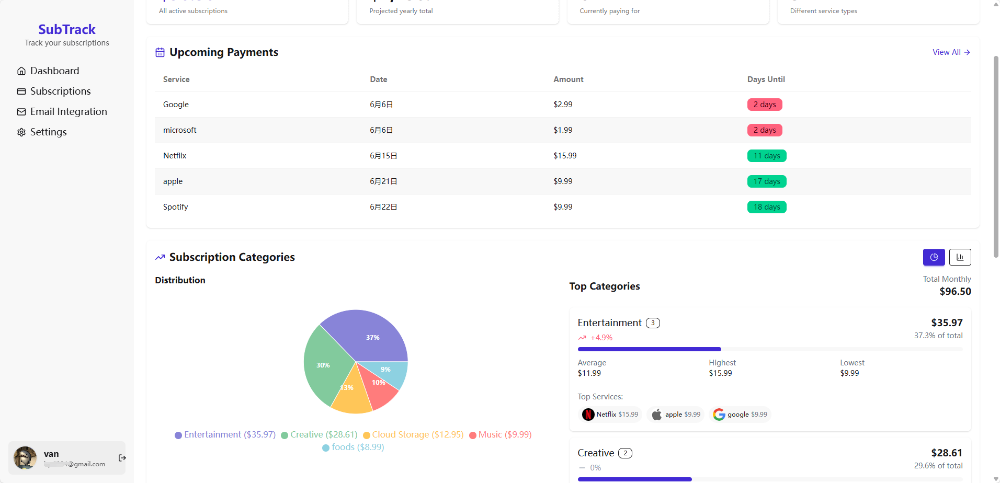
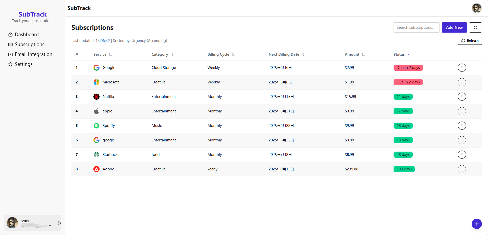
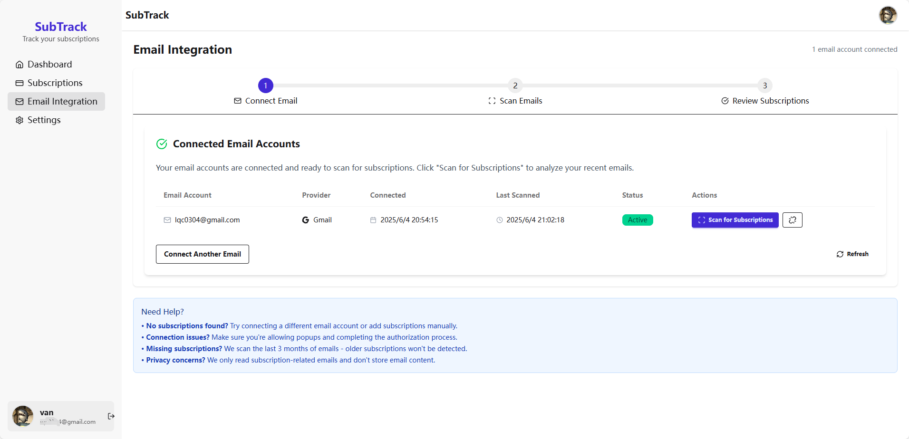
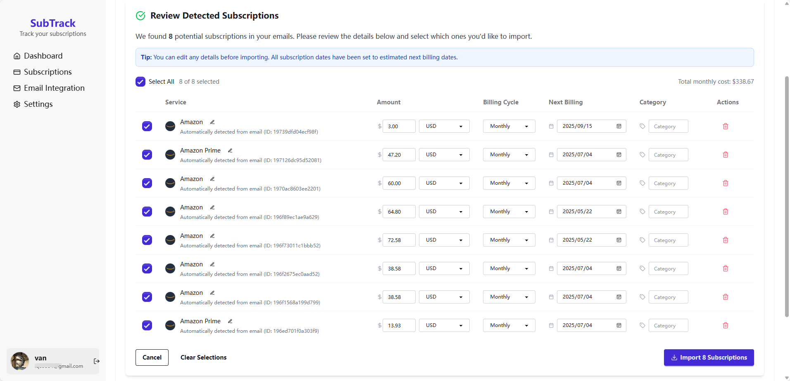

# SubTrack - Subscription Management Platform

A comprehensive full-stack application for tracking and managing your subscriptions with email integration and automatic billing detection.






## 🌟 Features

### Core Functionality
- **📊 Subscription Dashboard** - Comprehensive overview of all your subscriptions
- **💰 Financial Tracking** - Monthly/yearly cost calculations and analytics
- **📅 Billing Reminders** - Track upcoming payment dates and overdue subscriptions
- **🏷️ Category Management** - Organize subscriptions by type (Entertainment, Productivity, etc.)
- **🔄 Auto-Date Updates** - Automatically advance past-due billing dates

### Email Integration
- **📧 Gmail Integration** - Connect your Gmail account via OAuth
- **🤖 Smart Detection** - AI-powered subscription detection from emails
- **🎯 Pattern Matching** - Support for 30+ popular services (Netflix, Spotify, Amazon, etc.)
- **🧠 LangGraph Agents** - Use generative AI to review ambiguous emails and recover subscription details
- **🌍 Multi-language** - English and Chinese service detection
- **💱 Multi-currency** - Support for USD, EUR, GBP, CNY, and more

### User Experience
- **🎨 Modern UI** - Clean, responsive interface built with React and TailwindCSS
- **🌙 Theme Support** - Light and dark mode options
- **👤 User Profiles** - Customizable avatars and preferences
- **🔐 Secure Authentication** - JWT-based auth with password hashing
- **📱 Mobile Friendly** - Responsive design for all devices
- **💬 AI Spend Advisor** - Chatbot powered by LangGraph to suggest how to optimise monthly spend

## 🏗️ Architecture

### Frontend (React)
- **Framework**: React 18 with Vite
- **Styling**: TailwindCSS + DaisyUI
- **State Management**: React Query for server state
- **Routing**: React Router
- **Charts**: Recharts for data visualization

### Backend (Node.js)
- **Runtime**: Node.js 18 with Express
- **Database**: PostgreSQL 16
- **Authentication**: JWT with bcrypt
- **Email Integration**: Gmail API with OAuth 2.0
- **File Uploads**: Multer for avatar management
- **Background Jobs**: Cron jobs for subscription updates

### Infrastructure
- **Containerization**: Docker & Docker Compose
- **Reverse Proxy**: Nginx for frontend
- **Database**: PostgreSQL with optimized indexes
- **Environment**: Secure environment variable management

## 🚀 Quick Start

### Prerequisites
- Docker and Docker Compose
- Google Cloud Console account (for email integration)
- Git

### 1. Clone the Repository
```bash
git clone https://github.com/lqc412/Subtrack.git
cd subtrack
```

### 2. Environment Setup
```bash
# Copy environment template
cp .env.example .env

# Edit with your configuration
nano .env
```

Required environment variables:
```env
# Database
POSTGRES_DB=SubTrack_db
POSTGRES_USER=postgres
POSTGRES_PASSWORD=your_secure_password

# JWT Security
JWT_SECRET=your_32_character_random_string

# Google OAuth (for email integration)
GOOGLE_CLIENT_ID=your_google_client_id
GOOGLE_CLIENT_SECRET=your_google_client_secret
GOOGLE_REDIRECT_URI=http://localhost:5173/email/callback
```

### 3. Google OAuth Setup
1. Go to [Google Cloud Console](https://console.cloud.google.com/)
2. Create a new project or select existing
3. Enable Gmail API
4. Create OAuth 2.0 credentials
5. Add `http://localhost:5173/email/callback` to authorized redirect URIs
6. Copy Client ID and Secret to `.env` file

### 4. Start the Application
```bash
# Start all services
docker-compose up -d

# Check status
docker-compose ps

# View logs
docker-compose logs -f
```

### 5. Access the Application
- **Frontend**: http://localhost:5173
- **Backend API**: http://localhost:3000

## 📖 Usage Guide

### Getting Started
1. **Register Account**: Create your account at http://localhost:5173/register
2. **Add Subscriptions**: Manually add subscriptions or use email integration
3. **Connect Email**: Link your Gmail for automatic detection
4. **Monitor Dashboard**: Track spending and upcoming payments

### Email Integration Workflow
1. **Connect Gmail**:
   - Go to Email Integration page
   - Click "Connect Gmail Account"
   - Authorize access in popup window

2. **Scan Emails**:
   - Click "Scan for Subscriptions"
   - Wait for analysis to complete (LangGraph agent will review any unrecognized templates)
   - Review detected subscriptions

3. **Import Subscriptions**:
   - Select subscriptions to import
   - Edit details if needed
   - Confirm import

### Subscription Management
- **Add Manually**: Click "+" button or "Add New"
- **Edit Existing**: Click subscription row options
- **Set Categories**: Organize by Entertainment, Productivity, etc.
- **Track Billing**: Monitor next payment dates
- **Update Status**: Mark as active/inactive

## 🔧 Configuration

### Environment Variables

#### Required
```env
POSTGRES_PASSWORD=secure_password_123
JWT_SECRET=minimum_32_character_secret_key
GOOGLE_CLIENT_ID=your_google_oauth_client_id
GOOGLE_CLIENT_SECRET=your_google_oauth_secret
```

#### Optional
```env
# Ports (default values shown)
FRONTEND_PORT=5173
BACKEND_PORT=3000
DB_PORT=5432

# Application
NODE_ENV=production
FRONTEND_URL=http://localhost:5173

# LangGraph AI (optional but recommended for enhanced detection/chat)
LANGGRAPH_API_URL=https://your-langgraph-deployment
LANGGRAPH_API_KEY=your_langgraph_api_key
LANGGRAPH_EMAIL_AGENT_ID=subscription-email-agent
LANGGRAPH_CHAT_AGENT_ID=spend-coach-agent
LANGGRAPH_TIMEOUT_MS=15000

# Email notifications (future feature)
SMTP_HOST=smtp.gmail.com
SMTP_PORT=587
SMTP_USER=your_email@gmail.com
SMTP_PASSWORD=your_app_password
```

### Email Template Configuration

The application includes templates for detecting subscriptions from these services:

#### English Services
- **Streaming**: Netflix, Spotify, YouTube Premium, Disney+, HBO Max, Hulu
- **Cloud**: Google Workspace, Dropbox, iCloud, OneDrive
- **Productivity**: Microsoft 365, Adobe Creative Cloud, Notion
- **Development**: GitHub, GitLab, JetBrains
- **Communication**: Slack, Zoom, Discord Nitro

#### Chinese Services
- **Video**: iQIYI VIP, Tencent Video VIP, Youku VIP, Mango TV, Bilibili Premium
- **Music**: QQ Music, NetEase Cloud Music, Kugou Music
- **Cloud Storage**: Baidu Netdisk, Aliyun Drive
- **E-commerce**: Taobao 88VIP, JD PLUS
- **Productivity**: WPS Premium, Shimo Docs

## 🛠️ Development

### Local Development Setup
```bash
# Backend development
cd SubTrack-backend
npm install
npm run dev

# Frontend development
cd SubTrack-frontend
npm install
npm run dev

# Database (using Docker)
docker run -d \
  --name subtrack-db \
  -e POSTGRES_DB=SubTrack_db \
  -e POSTGRES_USER=postgres \
  -e POSTGRES_PASSWORD=password \
  -p 5432:5432 \
  postgres:16-alpine
```

### Project Structure
```
subtrack/
├── SubTrack-backend/          # Node.js backend
│   ├── src/
│   │   ├── controllers/       # Request handlers
│   │   ├── services/          # Business logic
│   │   ├── routes/           # API routes
│   │   ├── middleware/       # Auth & validation
│   │   ├── utils/           # Utilities
│   │   └── jobs/            # Background jobs
│   ├── uploads/             # File storage
│   └── Dockerfile
├── SubTrack-frontend/         # React frontend
│   ├── src/
│   │   ├── components/       # React components
│   │   ├── pages/           # Page components
│   │   ├── services/        # API clients
│   │   ├── context/         # React context
│   │   └── utils/           # Frontend utilities
│   └── Dockerfile
├── database/
│   └── init.sql             # Database schema
├── docker-compose.yml       # Container orchestration
└── .env                     # Environment variables
```

### API Endpoints

#### Authentication
- `POST /api/auth/register` - User registration
- `POST /api/auth/login` - User login
- `POST /api/auth/logout` - User logout
- `GET /api/auth/verify` - Token verification

#### Subscriptions
- `GET /api/subs` - Get all subscriptions
- `POST /api/subs` - Create subscription
- `PUT /api/subs/:id` - Update subscription
- `DELETE /api/subs/:id` - Delete subscription
- `GET /api/subs/search` - Search subscriptions
- `GET /api/subs/upcoming` - Get upcoming payments
- `GET /api/subs/stats` - Get statistics

#### Email Integration
- `GET /api/email/connections` - Get email connections
- `GET /api/email/auth-url` - Get OAuth URL
- `POST /api/email/callback` - Handle OAuth callback
- `POST /api/email/imports/:connectionId` - Start import
- `GET /api/email/imports/:importId` - Get import status

#### User Management
- `GET /api/users/me` - Get current user
- `PUT /api/users/profile` - Update profile
- `PUT /api/users/preferences` - Update preferences
- `PUT /api/users/password` - Change password

## 🔒 Security

### Authentication & Authorization
- **JWT Tokens**: Secure token-based authentication
- **Password Hashing**: bcrypt with salt rounds
- **CORS Protection**: Configured for frontend domain
- **Input Validation**: Request sanitization and validation

### Data Protection
- **Environment Variables**: Sensitive data in .env files
- **Database Security**: Parameterized queries prevent SQL injection
- **File Upload Safety**: Restricted file types and sizes
- **OAuth Security**: Secure Google OAuth implementation

### Network Security
- **Docker Networks**: Isolated container communication
- **HTTPS Ready**: SSL/TLS support for production
- **Rate Limiting**: API endpoint protection (configurable)

## 📊 Monitoring & Maintenance

### Container Status
```bash
# Container status
docker-compose ps

# Check service availability
curl http://localhost:3000/api/
curl http://localhost:5173/
```

### Logs
```bash
# All services
docker-compose logs -f

# Specific service
docker-compose logs -f backend
docker-compose logs -f frontend
docker-compose logs -f database
```

### Database Maintenance
```bash
# Backup database
docker-compose exec database pg_dump -U postgres SubTrack_db > backup.sql

# Restore database
docker-compose exec -T database psql -U postgres SubTrack_db < backup.sql

# Update email templates
docker-compose exec database psql -U postgres -d SubTrack_db -f update_templates.sql
```

### Background Jobs
The application runs automatic background jobs:
- **Subscription Updates**: Daily at 2 AM UTC
- **Job Status**: Check at `/api/admin/job-status`
- **Manual Trigger**: POST `/api/admin/trigger-update`

## 🚀 Deployment

### Production Environment
```bash
# Update environment for production
NODE_ENV=production
FRONTEND_URL=https://yourdomain.com
GOOGLE_REDIRECT_URI=https://yourdomain.com/email/callback

# Use external database (recommended)
PG_HOST=your-production-db-host
```

### Docker Production Build
```bash
# Build production images
docker-compose build --no-cache

# Start production services
docker-compose up -d

# Enable logging
docker-compose logs -f > app.log 2>&1 &
```

### Reverse Proxy (Nginx)
```nginx
server {
    listen 80;
    server_name yourdomain.com;
    
    location / {
        proxy_pass http://localhost:5173;
        proxy_set_header Host $host;
        proxy_set_header X-Real-IP $remote_addr;
    }
    
    location /api/ {
        proxy_pass http://localhost:3000;
        proxy_set_header Host $host;
        proxy_set_header X-Real-IP $remote_addr;
    }
}
```

## 🤝 Contributing

### Development Workflow
1. Fork the repository
2. Create feature branch: `git checkout -b feature/amazing-feature`
3. Commit changes: `git commit -m 'Add amazing feature'`
4. Push to branch: `git push origin feature/amazing-feature`
5. Open Pull Request

### Code Standards
- **Frontend**: ESLint + Prettier
- **Backend**: ESLint + Node.js best practices
- **Database**: PostgreSQL naming conventions
- **Commits**: Conventional commit messages

### Adding Email Templates
```sql
INSERT INTO email_templates (service_name, sender_pattern, subject_pattern, body_patterns, category) VALUES
('New Service', '.*newservice.*', '.*(subscription|payment).*', '{"amount": "\\$([0-9]+\\.?[0-9]*)", "date": "([0-9]{1,2}/[0-9]{1,2}/[0-9]{4})"}', 'Category');
```

## 🐛 Troubleshooting

### Common Issues

#### Email Integration Not Working
```bash
# Check Google OAuth configuration
echo $GOOGLE_CLIENT_ID
echo $GOOGLE_REDIRECT_URI

# Verify email templates
docker-compose exec database psql -U postgres -d SubTrack_db -c "SELECT COUNT(*) FROM email_templates;"
```

#### Database Connection Issues
```bash
# Check database status
docker-compose exec database pg_isready -U postgres

# Test database connection
docker-compose exec database psql -U postgres -d SubTrack_db -c "SELECT 1;"

# Reset database
docker-compose down -v
docker-compose up -d
```

#### Frontend Not Loading
```bash
# Check frontend build
docker-compose logs frontend

# Verify nginx configuration
docker-compose exec frontend nginx -t
```

#### Backend API Errors
```bash
# Check backend logs
docker-compose logs backend

# Test backend API
curl http://localhost:3000/api/

# Verify environment variables
docker-compose exec backend env | grep -E "(JWT|PG_|GOOGLE_)"
```

### Performance Optimization
- **Database Indexes**: Already optimized for common queries
- **Background Jobs**: Subscription updates run during off-peak hours
- **Caching**: Frontend caching via React Query
- **Image Optimization**: Avatar images are resized and compressed

## 📄 License

This project is licensed under the MIT License - see the [LICENSE](LICENSE) file for details.

## 🙏 Acknowledgments

- **React Team** - Frontend framework
- **Express.js** - Backend framework
- **PostgreSQL** - Database system
- **Google** - Gmail API integration
- **Docker** - Containerization platform
- **TailwindCSS** - Styling framework

---

**Built with ❤️ for subscription management**

*SubTrack - Take control of your subscriptions*